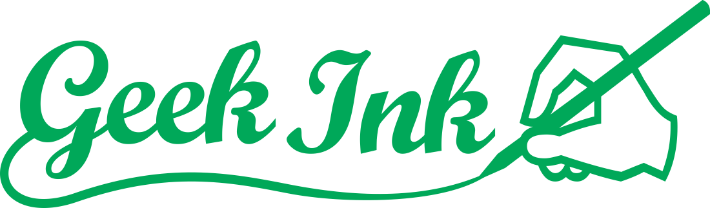
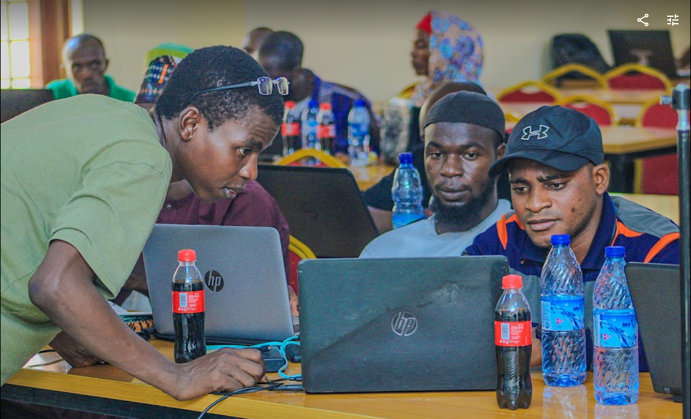
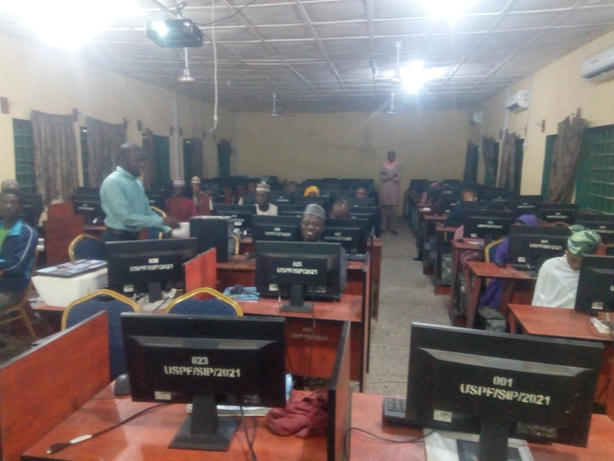

are you ready to start your journey into coding ? Learning to code opens doors to some of the most exciting and high-paying careers in the digital world today. But before you dive in, it’s important to understand that coding is more than just learning a language—it’s about building solutions, mastering problem-solving, and creating a better future for yourself. Here are the 
:::tip
**5 essential insights you need to know before learning to code** 
:::

and how **Geek Ink** can help you achieve the results you’re looking for.

## 1. Coding Is About Solving Problems, Not Just Learning Syntax
Many beginners focus solely on the technical aspect of coding, assuming that mastering a language like Python or JavaScript is enough to succeed. But the truth is, **coding is about solving problems that matter.** It’s about thinking critically, breaking down complex issues, and coming up with innovative solutions.

At **Geek Ink**, we don’t just teach you how to write code—we teach you how to **think like a problem-solver.** With our [hands-on projects](https://github.com/geekinks/GeekInk-Fullstack-Mastery-Roadmap/tree/main/projects) and mentorship, you’ll learn how to use code to solve real-world problems that make a difference. You won’t just be learning how to code—you’ll be learning how to create impact.

## 2. Success in Coding Requires Persistence, and We Help You Stay Motivated
Coding isn’t easy, especially in the beginning. You will encounter bugs, errors, and moments of frustration. It’s common for new learners to feel like giving up when things get tough. But here’s the reality: **everyone struggles at first, but persistence pays off.**

Geek Ink’s mentorship program is designed to keep you going. **You won’t be alone on this journey.** Our mentors guide you through the tough spots, offering support and advice based on years of experience. We provide a community that motivates you to push through challenges and stay focused on achieving your goals. With Geek Ink, you’ll learn how to turn setbacks into growth opportunities, ensuring you build the mindset you need to succeed in the tech world.

[join our mentorship program](https://forms.gle/MPk5Kuh6E9dxdqYy6) and unlock your potential.

## 3.  A Structured Learning Path Saves Time and Accelerates Your Progress
With so many coding resources available, it’s easy to get overwhelmed or lost. Many people spend months learning random concepts without seeing real progress. **You don’t need to waste time figuring it out on your own.**

The [Geek Ink roadmap](https://github.com/geekinks/GeekInk-Fullstack-Mastery-Roadmap) is a **step-by-step guide** designed to take you from a complete beginner to a job-ready developer. With our clear, structured approach, you’ll know exactly what skills you need to focus on and in what order. By following this roadmap, you’ll not only save time, but you’ll also build the skills that employers are looking for. **Our goal is to get you job-ready as efficiently as possible**—and we give you the tools to do that.

## 4. You Don’t Need a High-End Setup—We Provide the Tools You Need
One of the biggest misconceptions about learning to code is that you need an expensive computer or a fast internet connection. The reality is, **you can start coding with basic equipment.** But for those who face challenges like unreliable power, lack of a personal computer, or limited internet access, **Geek Ink’s fully equipped lab is here to solve that.**

When you join the Geek Ink mentorship program, you’ll have access to our **state-of-the-art lab**, equipped with everything you need to learn without worrying about technical limitations. Whether it’s a stable power supply, fast internet, or high-performance computers, **we’ve got you covered**, so you can focus solely on mastering your craft.

## 5. Community and Mentorship Are Game-Changers—We Offer Both
Learning to code can feel isolating, especially if you’re doing it on your own. But **success in tech is often driven by collaboration and community**. Having access to the right mentors and a supportive community can accelerate your learning, expose you to new ideas, and help you avoid common pitfalls.

At Geek Ink, you’re not just getting a mentor—you’re joining a **community of learners and professionals.** Our mentorship program pairs you with industry experts who will provide personalized guidance, help track your progress using GitHub Kanban boards, and ensure that you’re learning in a way that leads to tangible results. And you’ll always have a network of fellow learners to collaborate with, share ideas, and learn from.

:::tip Bonus 
Follow Our Free Roadmap for Success
At Geek Ink, we believe that learning should be accessible to everyone. That’s why we’ve made our [comprehensive roadmap free](https://github.com/geekinks/GeekInk-Fullstack-Mastery-Roadmap) for anyone who wants to learn web development own pace. This roadmap will guide you through everything you need to know to become a successful developer, whether you choose to follow it solo or join our mentorship program for additional support.
:::

You’ll get access to learning modules, hands-on projects, and a step-by-step plan that’s designed to take you from beginner to job-ready. And if you ever feel stuck or need help, our mentors and community are here to support you. Start your journey today and unlock the potential of a career in tech with Geek Ink.

Take the first step towards your dream tech career today! Explore [GeekInk Software Engineering Courses](https://forms.gle/MPk5Kuh6E9dxdqYy6) and unlock your potential.