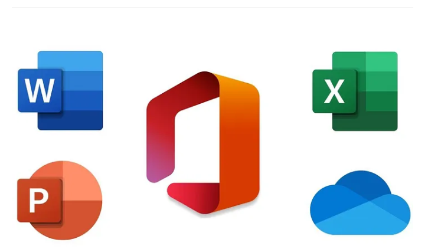

# General Computing Certificate Syllabus (2 Months)

:::tip
## Course Overview:
This comprehensive 2-month certificate program equips participants with essential computer skills and proficiency in Microsoft Word, Excel, and PowerPoint. The course caters to individuals with little to no prior computer experience, empowering them with the foundational knowledge and practical skills needed to thrive in today's digital world.
:::

## Course Objectives:
- Develop a fundamental understanding of computer hardware, software, and operating systems.
- Master basic computer operations, including file management, internet navigation, and email communication.
- Gain proficiency in Microsoft Word, Excel, and PowerPoint, creating professional documents, spreadsheets, and presentations.
- Enhance productivity and efficiency through effective utilization of computer applications.

## Course Schedule:
The course is divided into four modules, each focusing on a specific area:

  
Module 1: Introduction to Computers (2 Weeks)

- Computer Basics: Understanding computer components, hardware, software, and peripherals.
- Operating Systems: Introduction to operating systems (e.g., Windows, Linux) and basic operations.
- File Management: Creating, organizing, and managing files and folders.
- Internet Basics: Navigating the internet, using search engines, and understanding online safety.
- Email Communication: Setting up email accounts, composing and sending emails, and managing attachments.

    
Module 2: Microsoft Word (3 Weeks):

- Word Processing Basics: Creating, formatting, and editing documents.
- Text Formatting: Applying styles, fonts, and paragraph settings.
- Tables and Lists: Creating and customizing tables and lists.
- Objects and Images: Inserting and formatting images, shapes, and other objects.
- Document Collaboration: Sharing and collaborating on documents with others.

    
Module 3: Microsoft Excel (3 Weeks)

- Spreadsheet Basics: Creating and navigating spreadsheets, entering data, and using formulas.
- Formatting and Charts: Applying cell formatting, creating charts and graphs to visualize data.
- Functions and Formulas: Using built-in functions for calculations, data analysis, and automation.
- Data Management: Sorting, filtering, and managing large datasets.

    
Module 4: Microsoft PowerPoint (2 Weeks)

- Presentation Basics: Creating and designing presentations, adding slides, and applying themes.
- Text and Objects: Inserting and formatting text, images, shapes, and multimedia content.
- Slide Transitions and Animations: Applying transitions and animations for engaging presentations.
- Presenting and Sharing: Delivering presentations and sharing them with others.

    
Assessment:

- Continuous Assessment: Ongoing evaluation through quizzes, assignments, and practical exercises.
- Final Project: Participants will demonstrate their skills by creating a comprehensive project incorporating elements from all modules.

    
Certification:

Upon successful completion of the course and final project, participants will receive a General Computing Certificate, validating their proficiency in basic computer operations and Microsoft Office applications.

    
Additional Resources:

{/* - Access to online learning materials and tutorials. */}
- Practice exercises and sample projects.
- Support from instructors and teaching assistants.

## Invest in Your Future:
:::tip
- **Course Price:** **₦15,000 ~~₦20,000~~** (discounted price for the first 5 students)
:::

## Act Now! Limited Spots Available!
Don't miss your chance to gain essential computing skills! Enroll in our General Computing Certificate program today and unlock the full potential of digital literacy. Limited spots are available.

[Click here](#) to secure your place and start your journey to digital 

proficiency!

This General Computing Certificate program provides a solid foundation for further learning and empowers individuals with the essential skills to succeed in today's technology-driven world.
