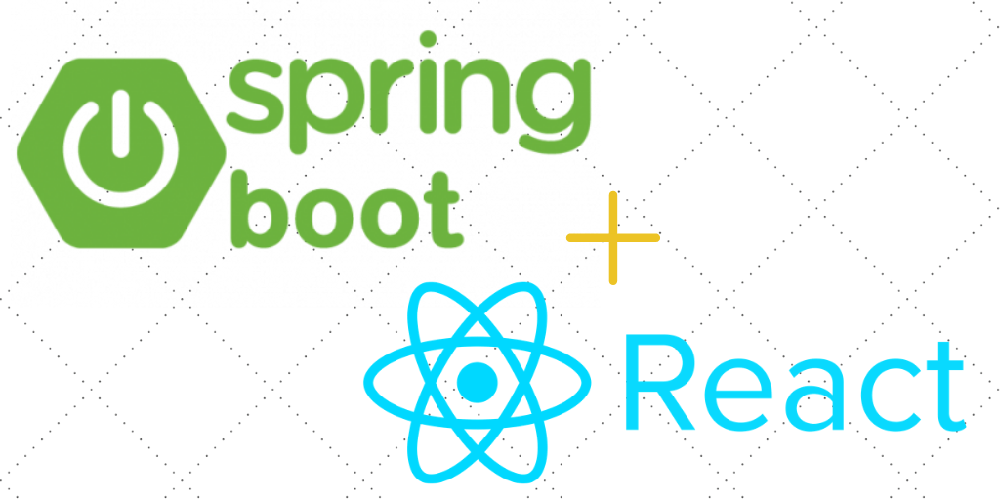

# Fullstack(React+spring)

## Conquer the Web: Master Full-Stack Development with React & Spring Boot

Join our transformative 4-month program, featuring a 1-month internship, designed to equip you with the skills and experience needed to become a highly sought-after full-stack developer. Master the dynamic duo of React for the frontend and Spring Boot for the backend, building powerful and scalable web applications that dominate the digital landscape.

## What is Full-Stack Development?
Full-stack developers are the versatile wizards of the web, proficient in both frontend (user interface) and backend (server-side) development. They possess the skills to build complete web applications, from the visual elements users interact with to the underlying databases and complex server logic.

## What Do Full-Stack Developers Do?
- **Build it all:** Create entire web applications, handling frontend user interfaces, backend logic, database management, and server infrastructure.
- **Work across the development spectrum:** Collaborate seamlessly with designers, product managers, and other developers to bring ideas to life.
- **Solve complex challenges:** Utilize their knowledge across various technologies to architect innovative solutions for the web.
- **Stay ahead of the curve:** Continuously learn and adapt to the ever-evolving world of web development, embracing new technologies and best practices.

## Why React & Spring Boot?
This powerful combination brings together the best of both worlds:
- **React:** A highly popular JavaScript library for crafting dynamic and engaging user interfaces, offering a component-based architecture for efficient and reusable code.
- **Spring Boot:** A robust and mature Java framework for building production-ready backend systems, simplifying development with auto-configuration, embedded servers, and a vast ecosystem of libraries.

## Our Approach: Learn by Building Real-World Projects
This program throws you into the action from day one. You'll build real-world applications, gaining practical experience and developing a portfolio that showcases your full-stack prowess to potential employers.

4-Month Intensive Course with 1-Month Internship

Become a highly sought-after full-stack developer with GeekInk's comprehensive program. This course combines frontend and backend development using React and Spring Boot, ensuring you have the skills to build dynamic and scalable web applications.

## Course Duration

4 Months (3 times a week, 48 classes of 2 hours each) + 1-Month Internship

## Course Objectives

- **Master Full-Stack Development:** Gain expertise in React and Spring Boot.
- **Develop Real-World Projects:** Apply your skills to build practical and impactful applications.
- **Internship Experience:** Work on real-world projects and build your professional network.
- **Career Guidance:** Receive mentorship and insights to navigate your career path effectively.

## Course Outline

  
Month 1: React Fundamentals & Spring Boot Backend Setup

  - **Project:** Build a personal blog with dynamic content, user authentication, and comment functionality.
  - **Skills:** HTML, CSS, JavaScript, React components, props, state, Node.js, Spring Boot basics, REST controllers, JPA, Spring Security.

  
Month 2: Full-Stack Integration & Database Management

  - **Project:** Develop a project management application with task creation, assignment, and real-time collaboration features.
  - **Skills:** React Router, state management, API integration, data fetching, Spring Data JPA, advanced database operations, security best practices.

  
Month 3: Advanced Full-Stack Techniques & Deployment

  - **Project:** Build an e-commerce platform with product listings, shopping cart, secure payment processing, and order management.
  - **Skills:** Advanced React patterns, testing, Spring Boot advanced features, cloud deployment, performance optimization, security hardening.

  
Month 4: 1-Month Internship for Real-World Experience

  - **Gain hands-on experience:** Apply your full-stack skills in a real-world company setting, working alongside experienced developers.
  - **Build your network:** Connect with industry professionals and gain invaluable insights into the job market and career opportunities.
  - **Polish your resume and portfolio:** Strengthen your credentials and stand out to potential employers with practical, real-world project experience.

## Expert Mentorship & Industry Guidance

Throughout the program and internship, you'll benefit from the guidance of seasoned full-stack developers who will share their expertise, provide valuable feedback, and help you navigate your career path.

## Invest in Your Future:

- **Course Price:** ₦50,000 (discounted to ₦30,000 for the first 5 students)

## Act Now! Limited Spots Available!

Ready to conquer the web and become a highly sought-after full-stack developer? Don't wait! Enroll in our "Conquer the Web: Master Full-Stack Development with React & Spring Boot" program today and unlock your true potential as a full-stack developer! Limited spots available! [Click here](#) to secure your spot and start building your full-stack future!